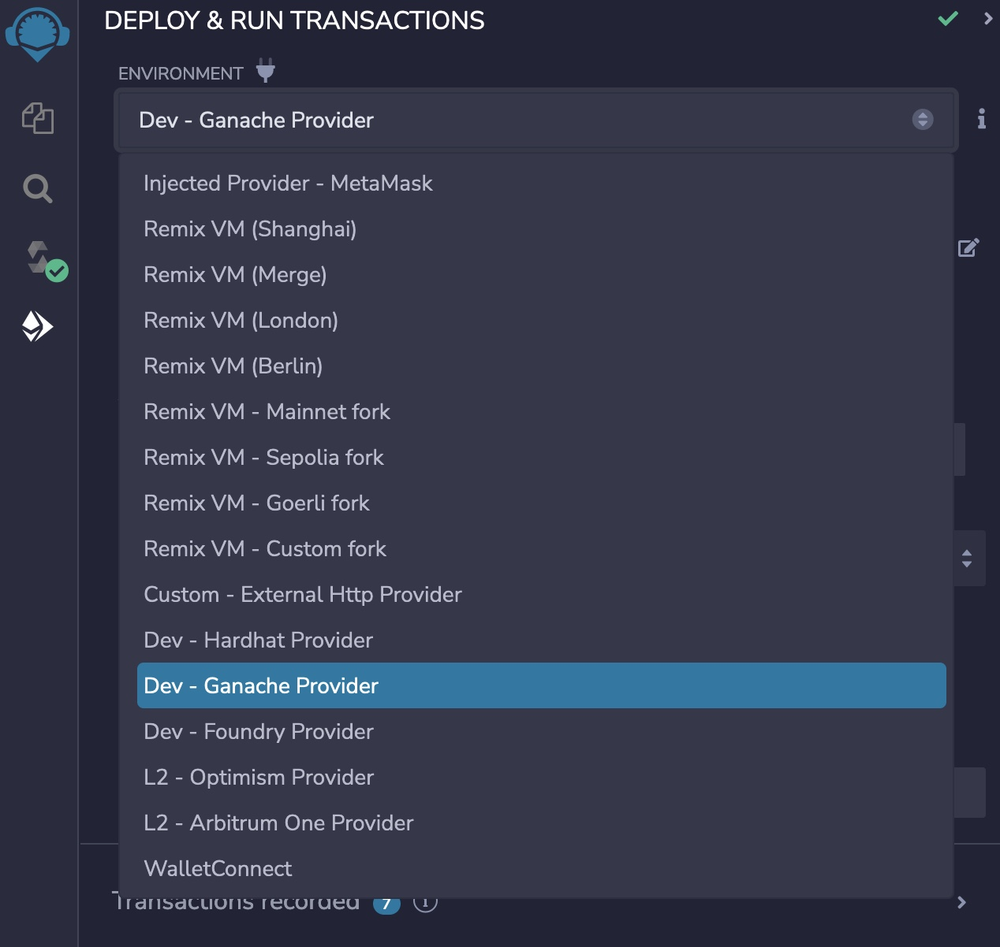
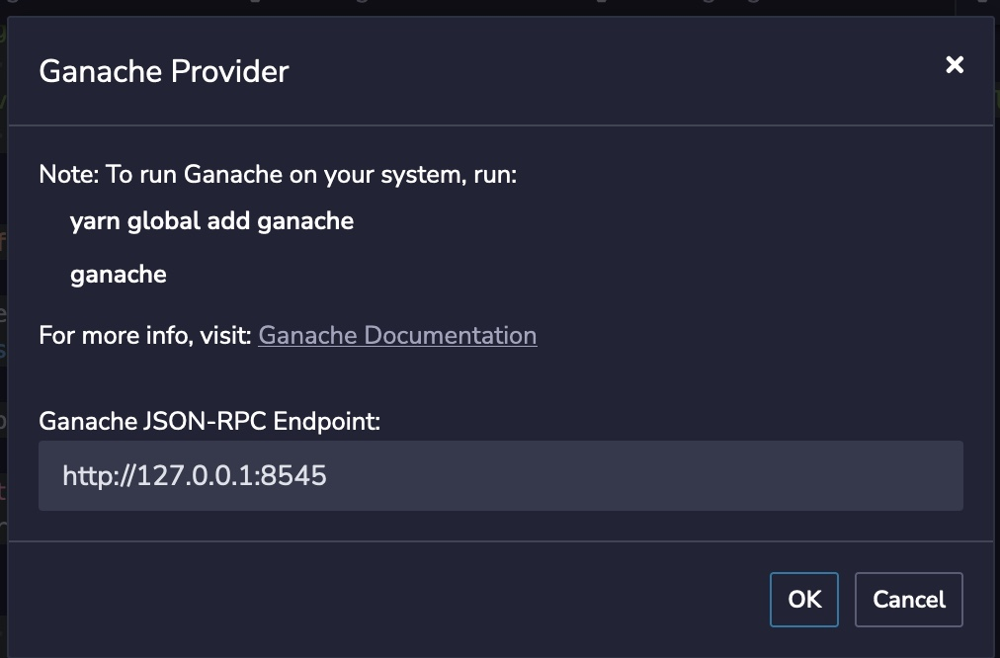
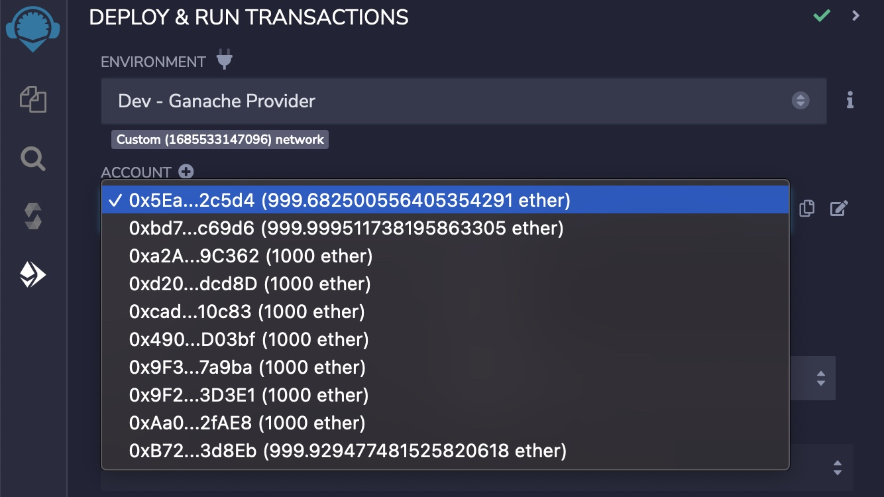
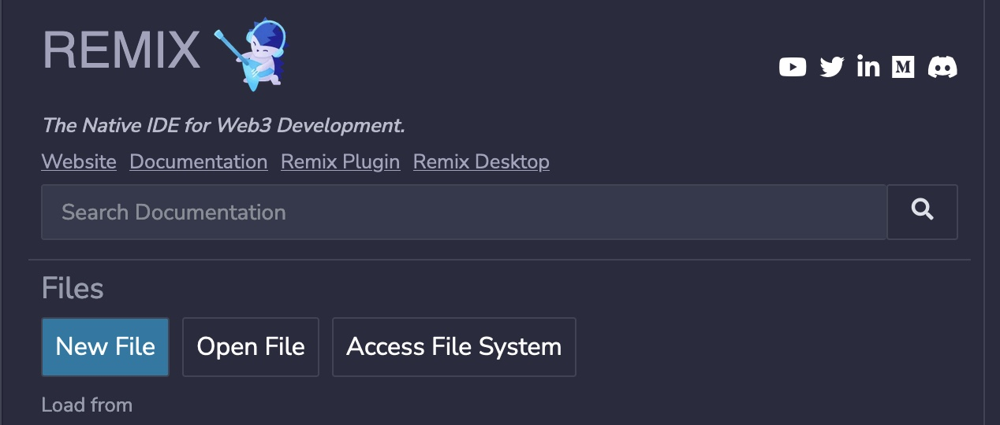
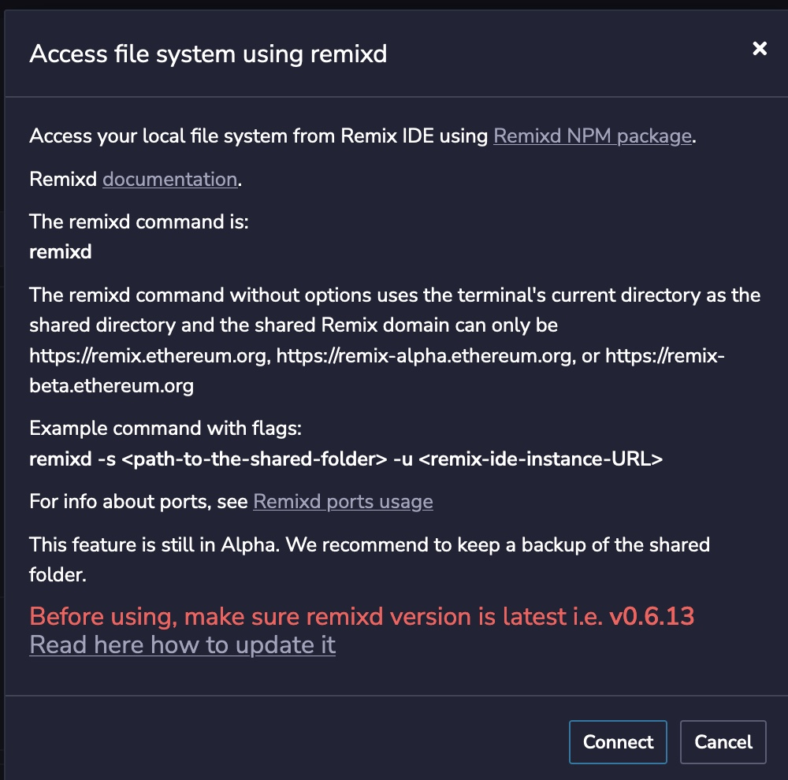
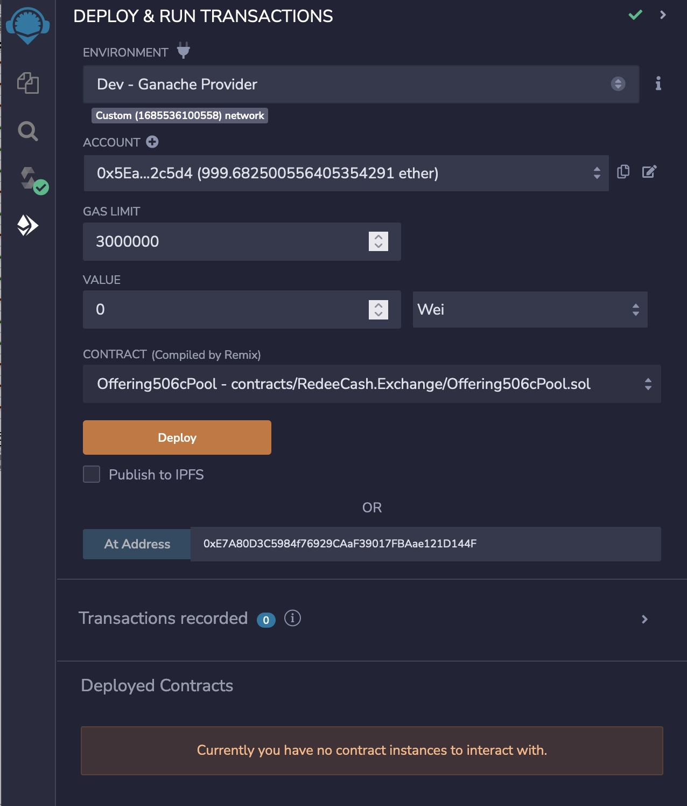
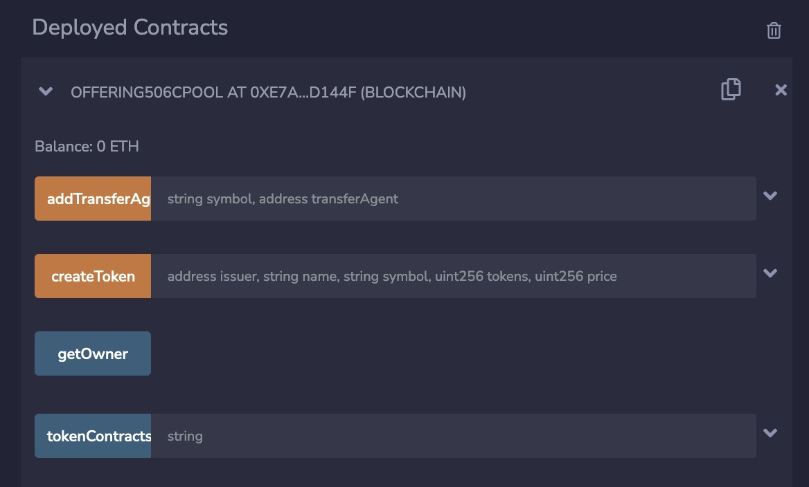

# Building and Developing

The development environment is self-contained and requires two prerequisites of NodeJS and Moongoose local instance. See mongo.md for instructions for installing mongoose. Optionally installing REMIXD using the command npm i remixd -g

## Setting up the Environment

1. Fork this repository, so any chnages you make can be saved
2. Clone your fork, git clone git@github.com:[YOUR USERNAME]/redeecash.exchange.git
3. Change to the src/ under your local copy of redeecash.exchange
4. Install node modules via npm install
5. Start GANACHE via the command, npm run start:ganache, this ensures your are using the same accounts
6. Open you browser to https://remix.ethereum.org
7. Select the Dev - Ganaache Provider

   
8. Press OK on the confirmation dialog

   
9. You should need you accounts listed

   
10. If GANACHE fails to start because of a resource unavailable error, close the terminal ro command prompt session and open a new terminal.

### Setting up REMIXD

Modifying the package.json within the src/directory, change

    "start:remixd": "node ../lib/bin/remixd -s`<REPLACE WITH THE ABSOLUTE PATH OF THIS DIRECTORY>`  --remix-ide https://remix.ethereum.org"

to

    "start:remixd": "node ../lib/bin/remixd -s`c:/projects/redeecash.exchange/src`  --remix-ide https://remix.ethereum.org"

if your source code is located at c:/projects/redeecash.exchange/src

### Connecting REMIX IDE to the Local File System

From the ide at https://remix.ethereum.org, press the Access File System button,

then the following dialog appears,

and press Connect, you should then navigate your code via the side panel.

## Invoking Existing Contracts

Under data/README.md#Offering Pools, provides a list of Offering Pool contracts. These are the contracts that will be used to create a new listing for an issuer. The issuer is a company that desires to raise public funds through a public or exempt offering.

Once connected to your local GANACHE, use the first account of 0x5EaF72deD2e4E255C228f9070501974D3572c5d4 as this is the contract owner,

Next copy the Pool contract address from the data/README.md#Offering Pools to the REMIX IDE and paste in the 'At Address' field, I am using the Offering506cPool contract address, and make sure the Offering506cPool.sol is selected in the contract drop down list,

Now press the At Address button. DO NOT PRESS Deploy unless you want a new contract deployed.

You should see the interface for the contract in the Deployed Contracts section.
