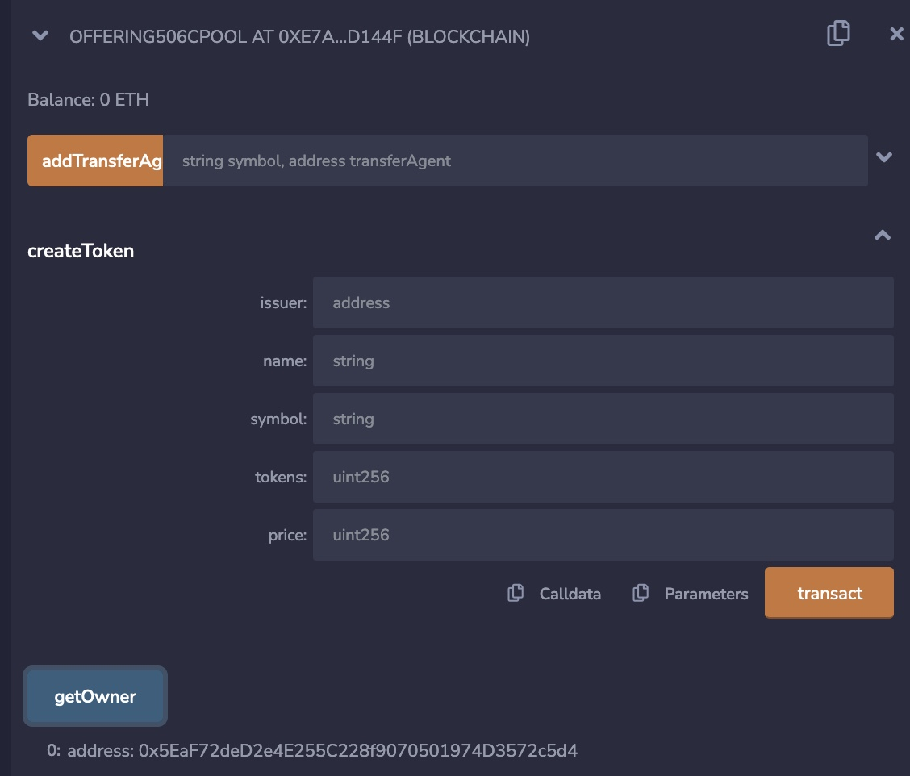
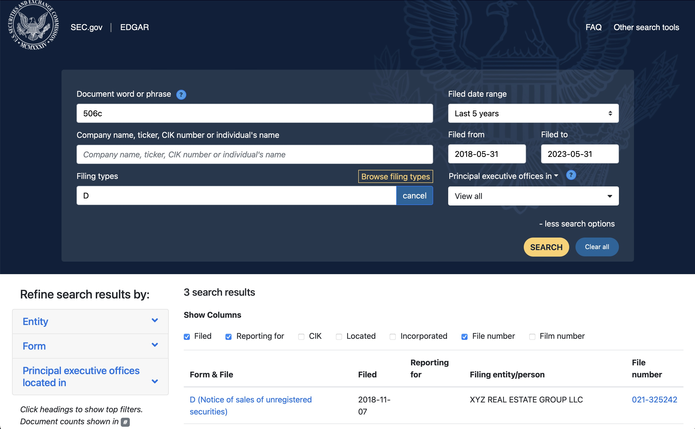
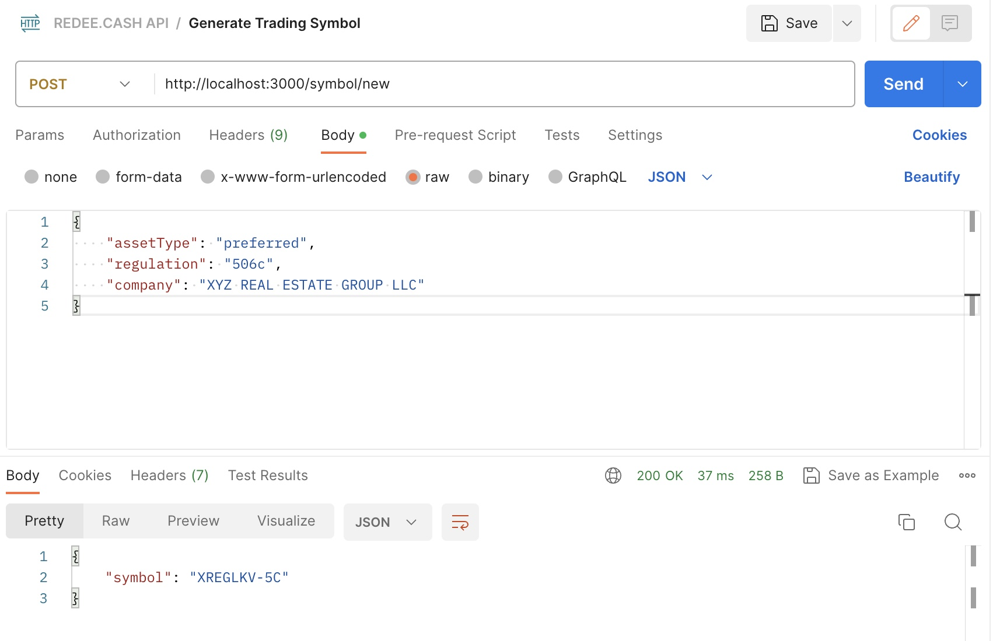
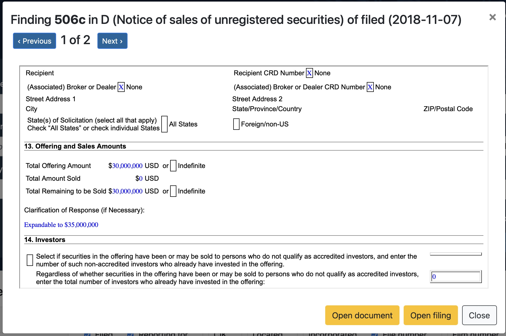
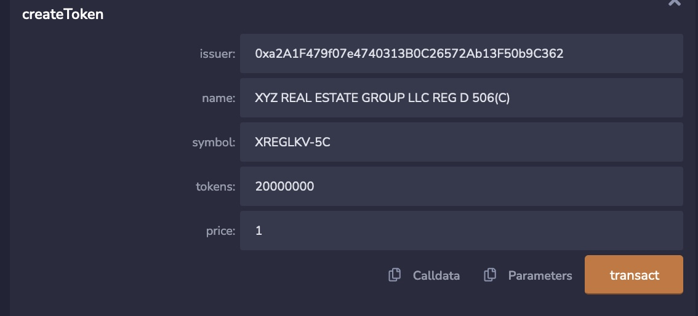
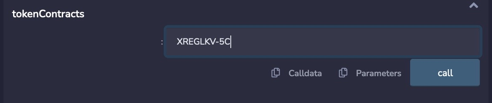
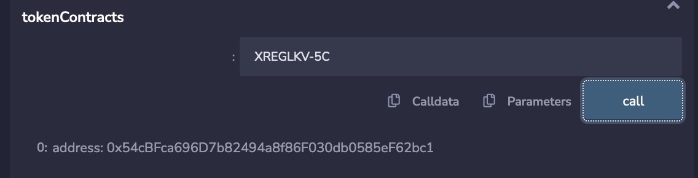
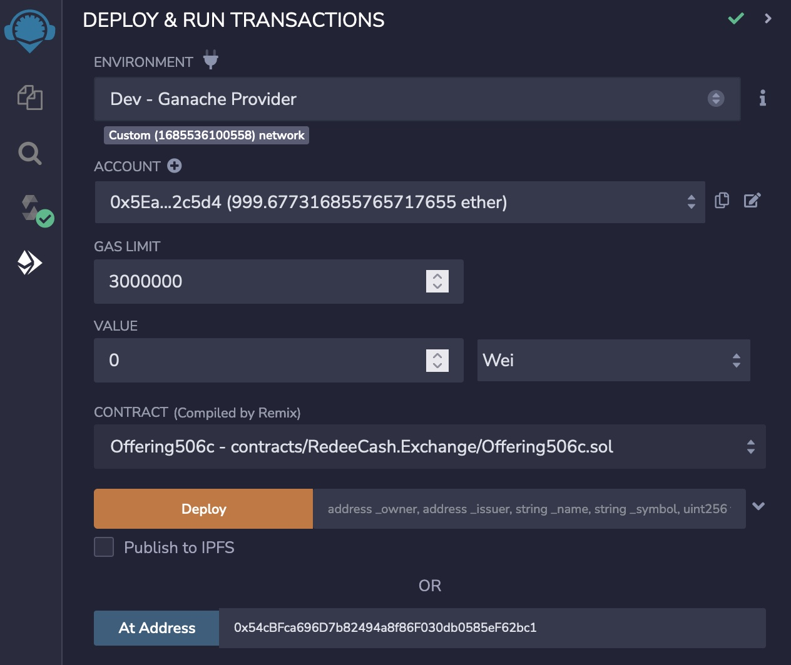
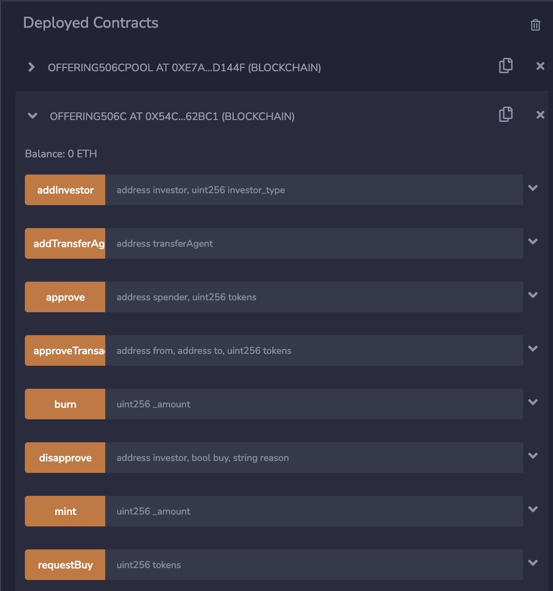

# Building and Developing

The development environment is self-contained and requires two prerequisites of NodeJS and Moongoose local instance. See mongo.md for instructions for installing mongoose. Optionally installing REMIXD using the command npm i remixd -g

## Setting up the Environment

1. Fork this repository, so any chnages you make can be saved
2. Clone your fork, git clone git@github.com:[YOUR USERNAME]/redeecash.exchange.git
3. Change to the src/ under your local copy of redeecash.exchange
4. Install node modules via npm install
5. Start GANACHE via the command, npm run start:ganache, this ensures your are using the same accounts
6. Open you browser to https://remix.ethereum.org
7. Select the Dev - Ganaache Provider

   
8. Press OK on the confirmation dialog

   
9. You should need you accounts listed

   
10. If GANACHE fails to start because of a resource unavailable error, close the terminal ro command prompt session and open a new terminal.

### Setting up REMIXD

Modifying the package.json within the src/directory, change

    "start:remixd": "node ../lib/bin/remixd -s`<REPLACE WITH THE ABSOLUTE PATH OF THIS DIRECTORY>`  --remix-ide https://remix.ethereum.org"

to

    "start:remixd": "node ../lib/bin/remixd -s`c:/projects/redeecash.exchange/src`  --remix-ide https://remix.ethereum.org"

if your source code is located at c:/projects/redeecash.exchange/src

### Connecting REMIX IDE to the Local File System

From the ide at https://remix.ethereum.org, press the Access File System button,

then the following dialog appears,

and press Connect, you should then navigate your code via the side panel.

## Invoking Existing Contracts

Under data/README.md#Offering Pools, provides a list of Offering Pool contracts. These are the contracts that will be used to create a new listing for an issuer. The issuer is a company that desires to raise public funds through a public or exempt offering.

Once connected to your local GANACHE, use the first account of 0x5EaF72deD2e4E255C228f9070501974D3572c5d4 as this is the contract owner,

Next copy the Pool contract address from the data/README.md#Offering Pools to the REMIX IDE and paste in the 'At Address' field, I am using the Offering506cPool contract address, and make sure the Offering506cPool.sol is selected in the contract drop down list,

Now press the At Address button. DO NOT PRESS Deploy unless you want a new contract deployed.

You should see the interface for the contract in the Deployed Contracts section.

### Creating a new listing

In this example, we are going to create a new listing for an exempt offering under Reg D Rule 506(c), we expand the createToken interface,

There are five parameters,

    - issuer, is a the wallet for the company. The issuer will also be the transfer agent repsonsible for transferring tokens to whitelisted investors. The contract own can only asigned additional transfer agents and whitelist investors.

    - name, this is a desscriptive name of the offering,

    - symbol, the trading symbol. Using the API route /symbol/new while supplying the asset type, regulation rule an ompany name, will cerate up to an 11 character trading symbol.

    - tokens, the number or total supply of the tokens issued. The issuer wallet will initially hold these tokens

    - price, the initial price for a single token.

presing the transaction button will create a new contract for this oferring. 

#### Creating a Trading Symbol

From a new terminal in the src/ directory, start the server,

    npm start

next we need a company that has issued an exemplt 506(c) offering, so we search SEC.GOV EDGAR,

and we see XYZ REAL ESTATE GROUP LLC, using postman connected to the API,

We specify asset type as preferred, as all exempt offerings on RedeeCash Echange are preferred equity offerings as well as the regulation of 506c, the symbol generated is

    XREGLKV-5C

this will be the symbol in the createToken procedure,

The total offering amount in this exempt offering is 30,000,000,

and since no price per share was specified, we will set the price per share at $1  and total tokens of 20,000,000, the input parameters are set as follows,

We are ready to press the transact button to create the new exempt offering token,

One the new token has been created, we need to get the new token contract address, by providing the symbol used,

and pressing the call button returns,

with the new token contract of **0x54cBFca696D7b82494a8f86F030db0585eF62bc1**

Then choosing the Offering506.sol contract and provide the At Address parameter with **0x54cBFca696D7b82494a8f86F030db0585eF62bc1**,

and pressing At Address button, 

which permits us to interact with the contract, remember that the account  0xa2A1F479f07e4740313B0C26572Ab13F50b9C362 is the issuer and initial transfer agent,
