# Digital Currency Trading

This exchange framework is equipped with smart contract to provide digital currency trading or any currency pair trading as a spot transaction.

To begin digital currency trading, access the contract for SpotCurrencyOrderBook. The digital currencies correlate with a gold reserves, that is in order to buy or sell token between wallets, there must be enough gold reserves or the transaction fails.

One such method of correlating gold reserves to a digital currency, is each time a trade buys tokens, the issuers purhases an equal amount os XAUUSD from a registered forex broker. When the trader withdrawals their token, the issuer will sell XAUUSD.

The issuer does not have custody of the gold reserves as these are at the forex broker, and does not have custody of the traders tokens, as those tokens reside in the traders wallet.

## Registering a new Token

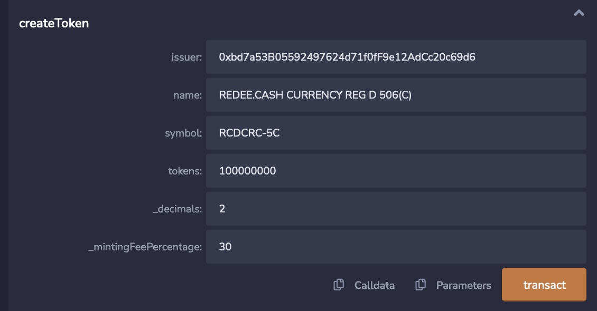

You will need to choose another wallet to be the issuer. The issuer is also the first transfer agent. In addition, you need to specify a name as description, a symbol, the maximum offering, any decimals and a fee.

To obtain the new token contract address requires a look up via the symbol,

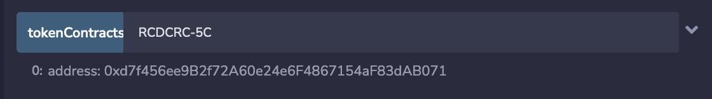

## Adding a Trader

Choosing another wallet, and accessing from the owner, as the contract owner white llists wallets,

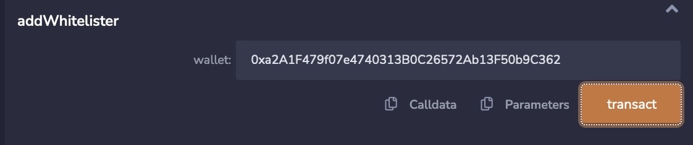

Now this wallet can mint, buy and sell (transfer) tokens, but before this wallet can mint new tokens, the issuer must assigned an allocation?

The process begins off chain using a money transmitter service like stripe or paypal, for the owner of this wallet to send monies for the amount tokens desired? The amount is determined by the exchange rate of gold. Once the issuer has received the funds from trader/investor, the issuer would purchase the dollar amount of XAUUSD or equivalent from a licensed forex broker, and set the allocation for this wallet.

## Set Investor Allocation

Accessing from the issuer's wallet,

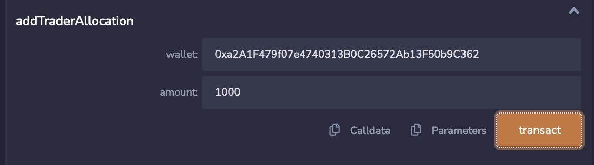

Now the trade can mint tokens to trade. The fee is also paid at the of minting. This fee permits income generation for the issuer, when new tokens are minted, so the gold reserves remain untoched until withdrawn on the behalf of the trader/investor.

## Adding to the Gold Reserves

Accessing from the issuer wallet,

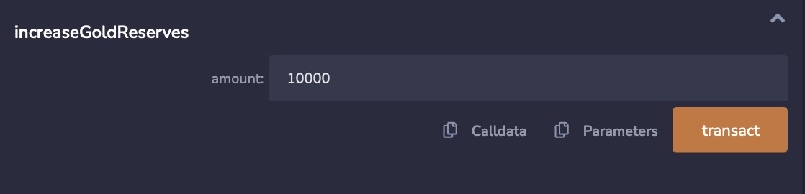

and checking the gold reserves,

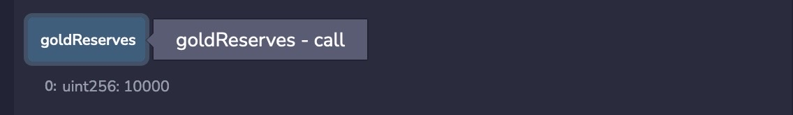

The issuer has hypothetically bought 10000 lots of XAUUSD from a FOREX broker before updating the contract gold reserves. If there were no gold reserves, the minting operation would fail.

## Minting New Tokens

Accessing from the trader/investor wallet, making sure the value is greater than zero to pay the minting fee,

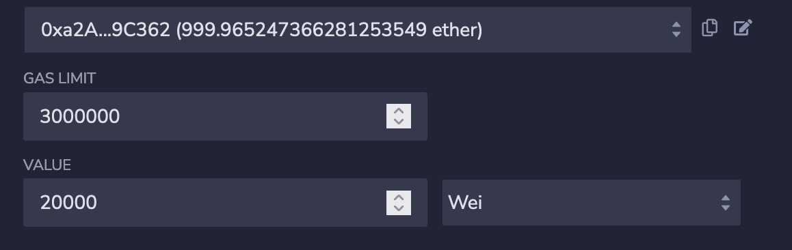

and then to mint the 1000 shares previously allocated by the issuer,

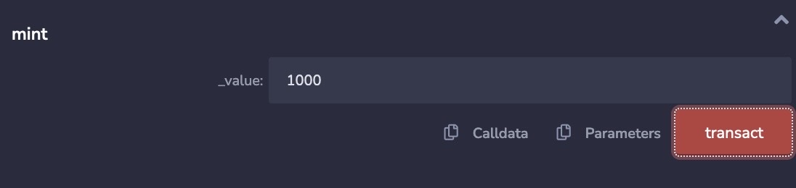

then verifying the token balance,

and the contract balance showing the fee addition

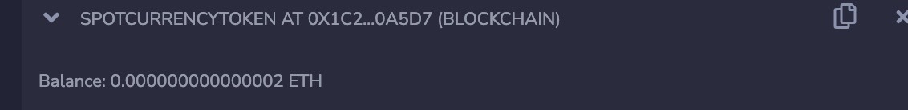

## Placing a Buy Order

As long as the trader/investor has been whitelisted and there are gold reserves, a trader can request a buy order of tokens from other traders that have a token balance.

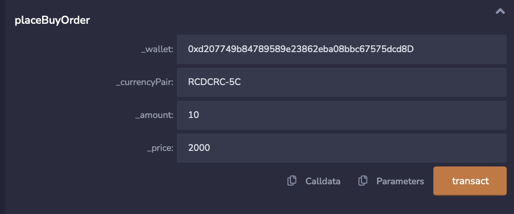

checkingg the buy orders status,

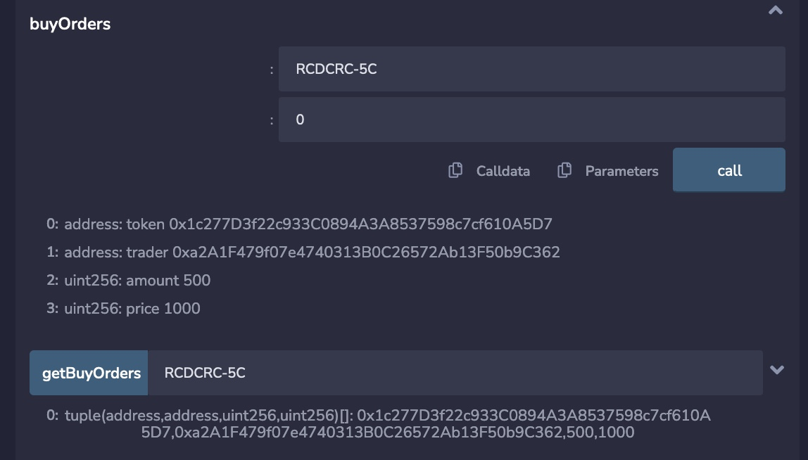

## Placing a Sell Order

The trader/investor must be whitelisted and have a token balance they have previously minted before they can place a sell order. Both the buy and sell order do not create or deplete tokens, they providing the trading mechanism between the investor wallets.

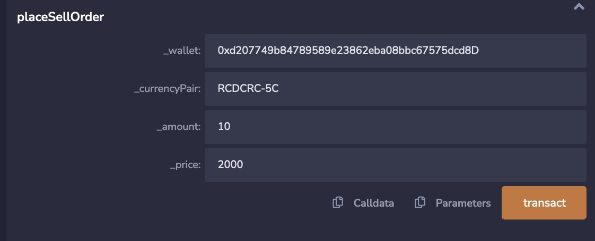

and checking the status of the sell order,

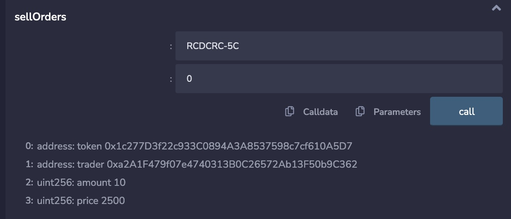

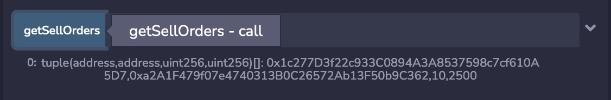
