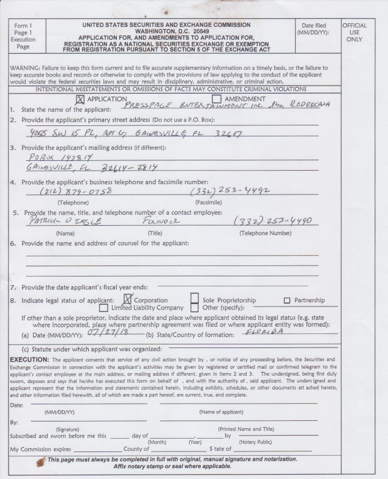

# redeecash.exchange

Future of Registered National Securities Exchange for Cryptocurrency Token Trading

## Registering a NMS Exchange

Begins with filing the SEC Form 1. The initial, unfilled cover page has been included,

## SEC Self-Regulatory Organization Rulemaking

    See https://www.sec.gov/rules/sro.shtml

    NMS Regulation Final Rule - https://www.sec.gov/rules/final/34-51808.pdf

    Consolidate Auditing Trail - https://www.catnmsplan.com/about-cat

## Consolidated Audit Trail

Each NMS must submit a mapping of CAT Report fields to Exchange-related fields,

| CAT Report Field | RedeeCash Exchange-related Field        |
| ---------------- | --------------------------------------- |
| senderIMID       | wallet address                          |
| routedOrderID    | the transaction hash                    |
| symbol           | the registered symbol, e.g. RCDCRC-5C  |
| eventTimestamp   | ISO zulu form (ISO 8601)                |
| session          | Will contain the blockchain transaction |

the above is subject to change until approved.

## About RedeeCash Exchange

An initial overview of the RedeeCash Exchange registration,

[RedeeCash Exchange Overview](files/RedeeCash_Exchange.pdf)

[Using Blockchain for Private Equity under Rule 506b](files/blockchain_rule506b.pdf)
